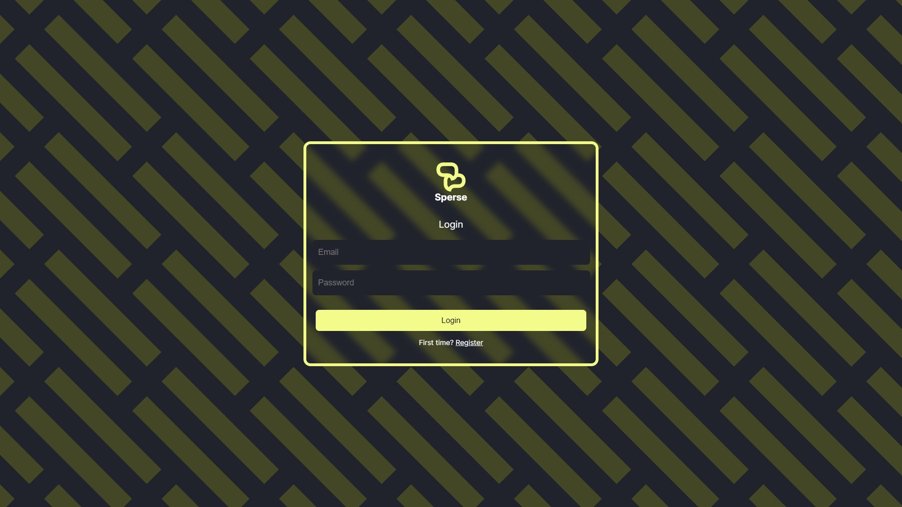
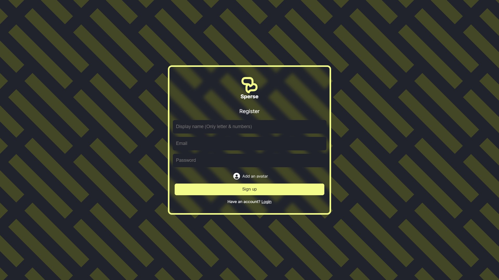
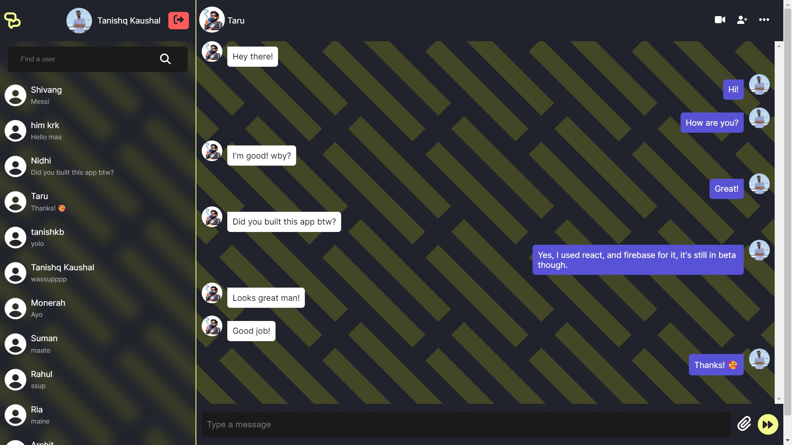

# Sperse
### Free & open-source chat application for everyone!


## Getting started

To get started, clone this repository and install the necessary packages.

```bash
  npm install
```
This will install the required libraries and modules to run this application.
After installation is complete run:

```bash
 npm run dev
```
This will run the application in development stage, and you can start building your own version on top of that.

Do keep in mind you'll have to replace the Google Firebase credentials in the .env file.


## What this app contains:

Sperse wil first cofirm if current user exists, via AuthContext, if it finds that there is no user, the app will route to /login page:



Upon clicking on 'Register', the user will be redirected to Register user page:



Both Login & Register pages work by accepting the input data and for login page, confirming the data with the existing firebase authentication databse, for registration page, confirming that the entered email is unique and then writing a new user in authentication.

After registration the user will be taken to home page.



## Upcoming features

- Light/dark mode toggle
- Share files other than images
- Change Username/Password/Avatar
- Notification
- Video chat


## Bugs
- If there's no image for any user show default user image
- Click anywhere to close the chats menu in mobile
- Click on the searched user to change chat
- Better overall responsiveness for mobile devices